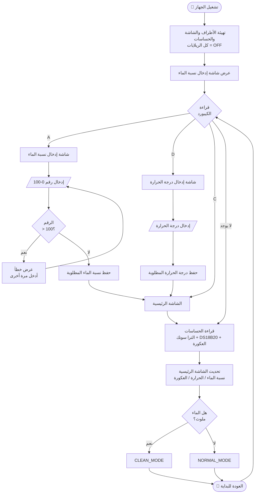
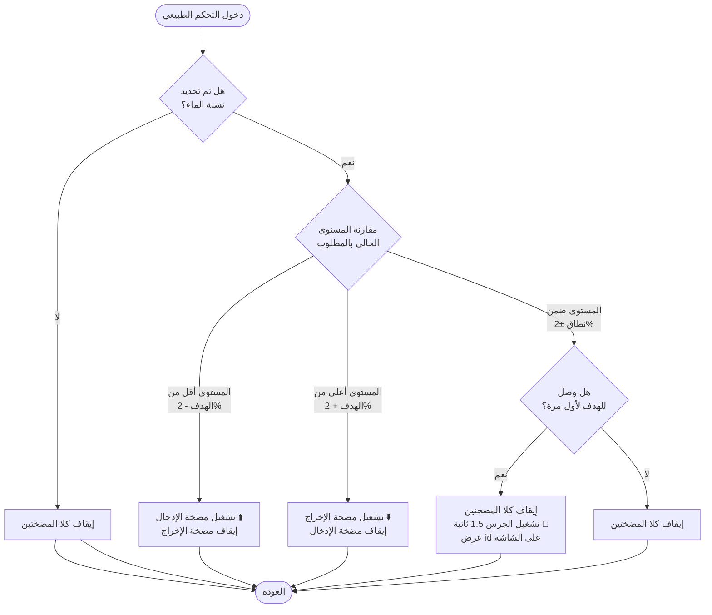
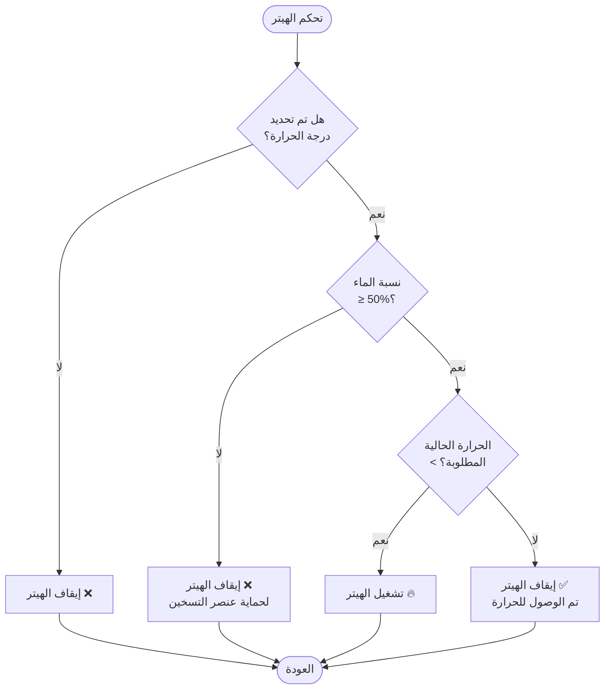
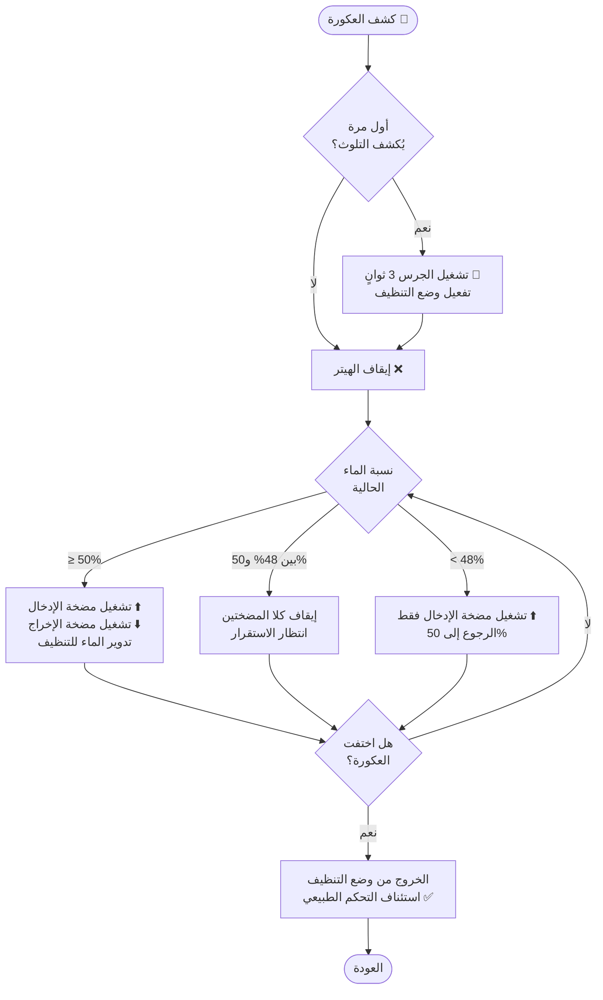
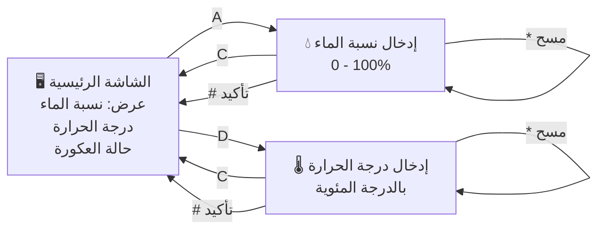
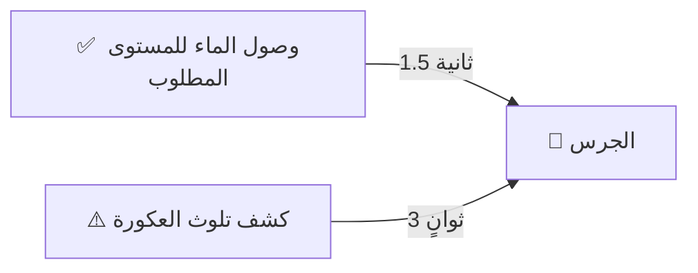

# Water Heating & Monitoring System — Flowchart

## 1. Main System Flow

---

## 2. Water Level Control (Normal Mode)

---

## 3. Heater Control

---

## 4. Turbidity Cleaning Mode

---

## 5. Keypad Navigation Map

---

## 6. Buzzer Trigger Summary

